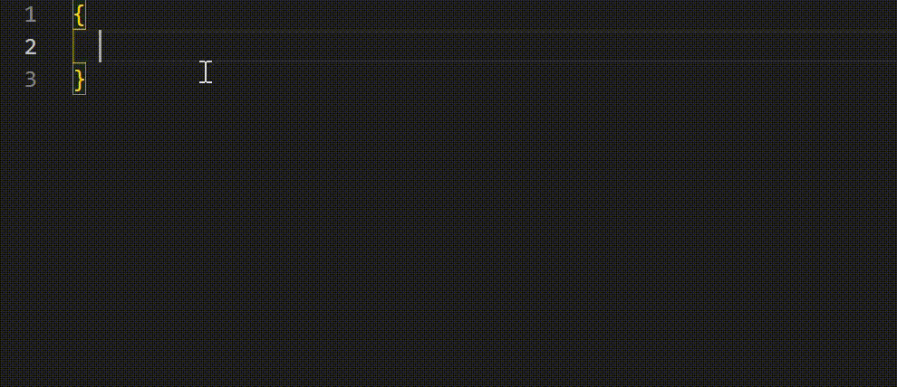

# datav-config-snippets

It is a tool helps to generate basic datav configs snippets.

## Features

You can type `dv + datav config type` to get corresponding datav config.

About the datav configs, you can see the [official document](https://help.aliyun.com/document_detail/155352.html?spm=a2c4g.11186623.6.1022.67f57151Qci35v).